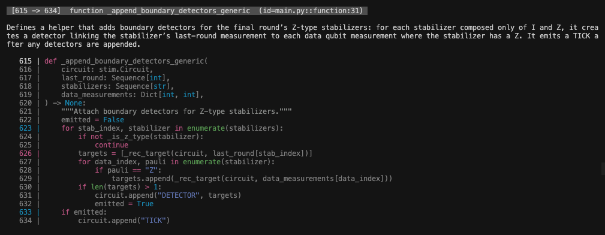

<div align="center">

<br>

An agentic CLI to prototype and share quantum code.

<p align="center">
<a href="https://www.python.org/downloads/"></a>
<!-- <a href="https://pypi.org/project/qernel"></a> -->
<a href="https://unitary.foundation"></a>
</p>

<!-- `pip install qernel` -->
Looking for the Qernel Zoo? [Go to qernelzoo.com.](https://www.qernelzoo.com)
</div>

### Installation

**Qernel is currently in a development preview and is subject to change. To be notified of all major changes, sign up for the Zoo.**

Since this project is under active development, the best way to install `qernel` is to build from source, which requires [Rust](https://rust-lang.org/tools/install/) and [Python](https://www.python.org/downloads/).
```bash
git clone https://github.com/computabeast/qernel.git
cd qernel

cargo install --path .

# Verify installation
qernel --help
```

### Creating a new project and prototyping with the CLI agent

The main value of the Qernel CLI is to decrease the time it takes to convert quantum concepts in literature and math to runnable quantum programs. The current CLI offers a streamlined way to do so:

```bash 
qernel new [YOUR_PROJECT_NAME] --template
```

This will create a Git repository named `my-project` with the following structure:

```bash
my-project/
├── README.md
├── .gitignore
├── src/                       # Your code here
│   ├── __init__.py
│   ├── main.py                
│   └── tests.py               
├── .qernel/                   # Environment were agentic work happens
│   ├── README.md
│   ├── spec.md
│   ├── benchmark.md
│   ├── qernel.yaml            # Qernel agent configuration file
│   ├── requirements.txt
│   └── .venv/
└── .git/
```

You can then prototype by pasting instructions in `.qernel/spec.md`, or automatically download and prototype a paper from [the arXiv](https://arxiv.org). A more comprehensive guide to using the prototype feature can be found in [src/README.md](./src/README.md).

```
qernel prototype
```

Or, one-shot prototype an arXiv paper into a fresh project:

```bash
qernel prototype --arxiv https://arxiv.org/abs/quant-ph/9605005
```

### Explaining code from existing projects

Quantum code can be specifically difficult to read through, mainly do the fact that lots of advanced math is abstracted away in helper functions. While this helps for readability, it makes experimenting and understanding different packages a pain. If you run:

```bash
qernel explain path/to/file.py
```

Qernel can analyze a file piece by piece and output a text explanation for each section, e.g.:

<p align="center">
  
  <br>
  <em>Explaining code from an existing project</em>
</p>

You can also output results of the file to Markdown by adding the `--markdown` flag:

#### Tips:
 - `qernel explain` works best for files over 1000 lines, but we're working on larger context sizes.
 - Run `qernel explain --help` to see the full functionality.

### Limitations

- This project currently relies on AI models that are not optimized for quantum computing concepts/programming, and therefore may not always produce accurate results. **We are actively working to solve this issue.** However, we've seen strong potential in AI models to mathetmatically reason (see [here](https://deepmind.google/discover/blog/advanced-version-of-gemini-with-deep-think-officially-achieves-gold-medal-standard-at-the-international-mathematical-olympiad/), [here](https://x.com/alexwei_/status/1946477742855532918)), and expect this accuracy gap to decrease over time.
- The core infrastructure logic to edit and maintain files in a repository was ported over from the [Codex CLI](https://github.com/openai/codex), and as a result, currently only works with OpenAI models. The [main agent loop]() natively supports the `codex-mini-latest` and `gpt-5-codex` models, if you'd like to use another model, you might need to edit the code and rebuild until we extend the support.
- You currently need to use your own OpenAI API key to access the models, you can create an account and get one from the [OpenAI API Platform site](https://platform.openai.com/docs/overview).
- We're actively working to migrate away from the OpenAI API to [Ollama](https://ollama.com), which will allow you to run your own models locally on your computer, access a suite of open source models, or use a cloud model if you wish.


### Tips for best performance

- For one-shot prototyping of arXiv papers, it's highly recommended to use `gpt-5-codex` with detailed implementation notes in `spec.md`. The model is surprisingly good if you tell it exactly what you want. The drawbacks are that it's expensive.
- For smaller examples that do not involve high context, `codex-mini-latest` with a well formatted spec file and well written tests can often get the job done.
- The agents looks at the tests in `src/tests.py` to form its implementation, and will automatically run its solutions against the test suite upon each iteration to mold its implementation. You can set the `--max-iter` flag to limit how many times it tries. Simple tests can significantly improve and speed up the implemetation process.

### Cloning and sharing projects

The `qernel` CLI also makes it easy to upload projects to the [Qernel Zoo](https://qernelzoo.com), a hub to collaborate and share quantum computing experiments. You can login to the Zoo with:

```bash
qernel auth
```

And then enter in your PAT from the Zoo website. You can then push and pull projects in the same way you would use Git/Github.

```bash
qernel push <URL>
qernel pull <REPO> <DEST>
```

